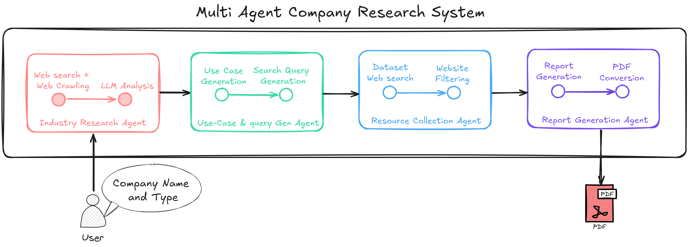

# Research & RAG Assistant

## Table of Contents
1. [Introduction](#introduction)
2. [Prerequisites](#prerequisites)
3. [Installation](#installation)
4. [Configuration](#configuration)
5. [Usage](#usage)
    - [Company Research Tab](#1-company-research-tab-)
    - [Document Q&A Tab](#2-document-q-a-tab-)
6. [Workflow](#workflow)
7. [Demo Link](#demo-link)
8. [Contributing](#contributing)
9. [License](#license)

---

## Introduction

The Research & RAG Assistant is an AI-powered web application designed to assist users in two main areas:
1. **Company Research**: Automatically generates detailed research reports about companies, including their industry trends and AI implementation opportunities.
2. **Document Q&A**: Enables users to upload documents and have intelligent conversations about their content, combining document knowledge with web search capabilities for comprehensive answers.

This application is ideal for businesses, researchers, and professionals seeking efficient tools for company analysis and document-based inquiry.

---

## Prerequisites

To use the Research & RAG Assistant, you will need:
1. **Python**: Version 3.10 or later.
2. **API Keys**:
   - OpenAI API Key: Required for AI-powered functionalities.
   - Tavily API Key: Required for web search in the Company Research module.
   - Pinecone API Key: Required for managing the document storage system.
3. **Supported File Formats**: For Document Q&A, ensure your files are in one of the supported formats (PDF, Word, TXT, PowerPoint, Markdown).

---

## Installation

Follow these steps to set up the Research & RAG Assistant on your local machine:

1. **Clone the Repository**:
   ```bash
   git clone https://github.com/anindyamitra2002/Multi-Agent-Research-and-RAG-System.git
   cd Multi-Agent-Research-and-RAG-System
   ```

2. **Create a Virtual Environment**:
   ```bash
   python3 -m venv venv
   source venv/bin/activate   # On Windows: venv\Scripts\activate
   ```

3. **Install Dependencies**:
   ```bash
   pip install -r requirements.txt
   playwright install
   export PYTHONPATH=.
   ```

4. **Run the Application**:
   ```bash
   streamlit run app.py
   ```

---

## Configuration

To configure the application, follow these steps:

### API Keys
1. Navigate to the **Configuration** section in the app.
2. Enter your API keys:
   - OpenAI API Key (required for both features)
   - Tavily API Key (required for Company Research)
   - Pinecone API Key (required for Document Q&A)
3. Click the **Save** button. A green success message will confirm that the configuration is complete.

### Optional Settings
- **Web Search**: For Document Q&A, you can enable web search to include online resources in the response.

---

## Usage

### 1. Company Research Tab (🔍)
1. **Setup**:
   - Enter your OpenAI and Tavily API keys in the Configuration section.
2. **Generate Report**:
   - Enter the company name (e.g., "Tesla") and industry (e.g., "Automotive").
   - Click **Generate Research Report**.
3. **Download Report**:
   - The system creates a comprehensive PDF report and provides a download button.

### 2. Document Q&A Tab (💬)
1. **Setup**:
   - Enter your OpenAI and Pinecone API keys in the Configuration section.
   - Optionally enable web search for additional context.
2. **Upload Documents**:
   - Select and upload your documents.
   - Click **Process Documents** to analyze them.
3. **Start Chatting**:
   - Use the chat interface to ask questions about your documents.
   - View responses, which combine document knowledge and optional web search results.

---


## Workflow

### **Company Research Workflow**


#### 1. **Input Phase**
- **User Inputs**:  
  - The user enters the company's name (e.g., "Tesla") and the industry (e.g., "Automotive").
  - The system validates these inputs to ensure they are correctly specified.
  
---

#### 2. **Research Phase**
- **Web Search and Data Gathering**:  
  - The system uses the Tavily API to crawl and gather publicly available information about the company and industry from the web.  
  - It filters out irrelevant or redundant data, retaining only high-quality and relevant information.  

- **Natural Language Processing (NLP)**:  
  - NLP models analyze the retrieved content to identify key insights about the company’s operations, market position, and current industry trends.  

---

#### 3. **AI Opportunity Analysis**
- **Identifying Use Cases**:  
  - The system evaluates four core areas for AI opportunities:  
    1. **Internal Process Optimization**: How AI can make operations more efficient.  
    2. **Customer Experience Enhancement**: AI-driven improvements in serving customers.  
    3. **Product Innovation**: Developing new or enhanced products/services using AI.  
    4. **Data Analytics**: Leveraging AI for better decision-making.

- **Feasibility Analysis**:  
  - The system assesses the benefits, resource requirements, and potential challenges for each opportunity.  

---

#### 4. **Resource Discovery**
- **Curated Resources**:  
  - The system searches for datasets, tools, and platforms that can support the identified AI use cases.  
  - It also identifies example projects and implementation frameworks that can serve as references.  

---

#### 5. **Report Generation**
- **Natural Language Generation (NLG)**:  
  - A human-readable report is generated using advanced NLG models.  

- **Report Contents**:  
  - **Executive Summary**: High-level findings and actionable recommendations.  
  - **Industry Analysis**: Comprehensive insights into market opportunities.  
  - **AI Implementation Opportunities**: Detailed use cases and their feasibility.  
  - **Implementation Roadmap**: A 12-month action plan, broken into four phases:
    - **Months 1-3**: Initial Setup  
    - **Months 4-7**: Development  
    - **Months 8-9**: Pilot Testing  
    - **Months 10-12**: Full Implementation  
  - **Resource Catalog**: A curated list of tools, datasets, and references.  

---

#### 6. **Output Delivery**
- The generated report is compiled into a PDF for download.  
- Users can access the identified resources and implementation roadmap directly.  

---

### **Document Q&A Workflow**

#### 1. **Input Phase**
- **Upload Documents**:  
  - The user uploads documents in supported formats such as PDF, DOCX, PPTX, or Markdown.  
  - Multiple documents can be uploaded simultaneously for analysis.  

---

#### 2. **Document Processing**
- **Semantic Chunking**:  
  - The system breaks down the documents into meaningful chunks for efficient retrieval.  
- **Vector Embeddings**:  
  - Each chunk is converted into vector embeddings using advanced multilingual models.  

- **Storage in Pinecone**:  
  - The processed document chunks are stored in Pinecone's vector database for fast and accurate retrieval.  

---

#### 3. **Query Phase**
- **User Queries**:  
  - Users can type questions related to the content of the uploaded documents.  
  - The system validates and preprocesses the query for efficient retrieval.  

- **Document Retrieval**:  
  - Relevant document chunks are retrieved from Pinecone based on semantic similarity to the query.  

---

#### 4. **Answer Generation**
- **Combining Information**:  
  - Retrieved document content is combined with context from the query.  
- **Language Model Response**:  
  - OpenAI’s language model generates a human-like, detailed answer to the query.  

- **Optional Web Search**:  
  - If enabled, the system supplements document-based answers with information retrieved from the web for enhanced accuracy and depth.  

---

#### 5. **Output Delivery**
- **Streaming Responses**:  
  - The system streams answers in real-time, simulating a natural conversation experience.  
- **Interactive Chat Interface**:  
  - Users can ask follow-up questions for clarification or additional details.  

--- 

#### **Key Advantages of the Workflow**  
1. **Efficiency**: Handles large document sets and generates responses quickly.  
2. **Accuracy**: Combines document retrieval and web search for high-quality answers.  
3. **Interactivity**: Supports natural, conversational question-answering.  
4. **Scalability**: Can process and retrieve information from extensive document collections.  
---

## Demo Link

Try the live demo here: [Research & RAG Assistant](https://example-link-to-demo.com)

---

## Contributing

Contributions are welcome! To contribute:
1. Fork the repository.
2. Create a new branch for your feature or bug fix:
   ```bash
   git checkout -b feature-name
   ```
3. Commit your changes:
   ```bash
   git commit -m "Add new feature"
   ```
4. Push to your branch:
   ```bash
   git push origin feature-name
   ```
5. Submit a pull request.

---

## License

This project is licensed under the MIT License. See the [LICENSE](LICENSE) file for details.

